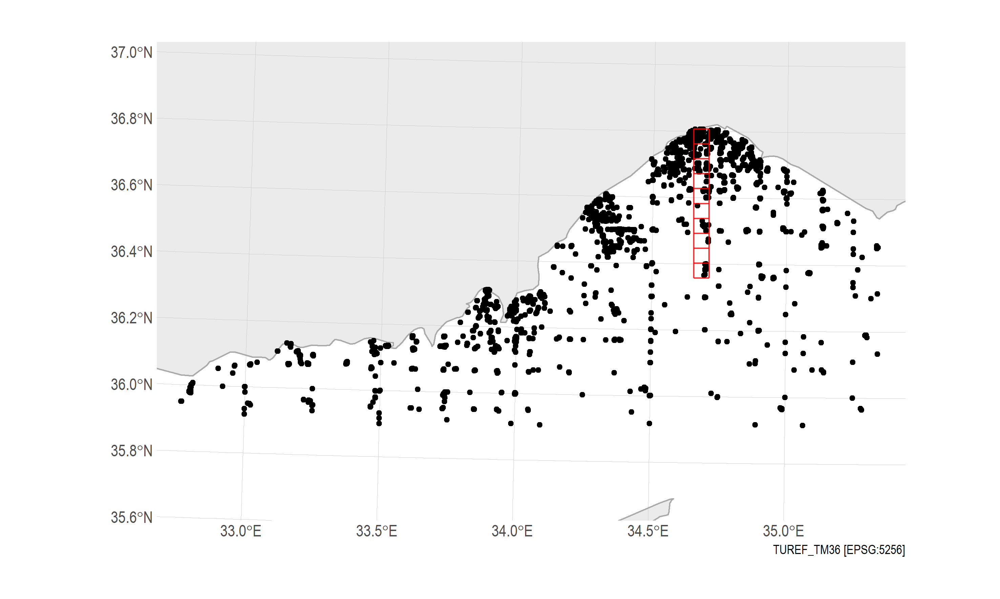
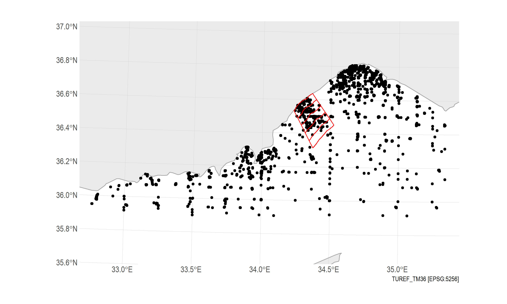

# ETC-ICM trends Mersin

### Preprocessing

The folder [data](/data/) contains the input data for the assessments.

The file received from METU was a text file `data_from_Mersin.txt`. This is data exported from an odv file. Before importing into R, I used a visual basic script `preprocess.wsf` to manipulate the data into a format more easily read by R. In theory this could all be done directly in R but it was quicker for me to add this extra step outside R.
The script file was run using the windows batch file `preprocess.bat`. The restructured data is saved as the file  `data_from_Mersin_for_R.txt`.

### Import to R
The file  `data_from_Mersin_for_R.txt` is read into an R data frame using [Mersin_read_data.R](/Mersin_read_data.R). The data frame is saved as an R data file `data_from_Mersin.Rda`

### Transects
Two transects are defined for making the HEAT calculations: *Mersin* and *Erdemli*. The code for plotting these transects is in the file [Mersin_plot_transects.R](/Mersin_plot_transects.R)

#### 1. Mersin Transect 
The first transect starts at Mersin (TM36 x=381962 y=4075951). The transect is divided into 5 km x 5 km grid squares and extends southwards from the coast at Mersin 50 km out into open waters, giving 10 assessment units within the transect.

#### 2. Erdemli Transect 
The second transect starts at Erdemli. In ArcGIS, the *buffer* function is used to divide the waters into bands of distance from the coast at 5 km intervals, up to 25 km, giving 5 bands in total, each 5 km wide. The lateral start and end boundaries of the bands perpendicular to the coastline were chosen arbitrarily, intending only to enclose the area with relatively high density of observations close to Erdemli.

