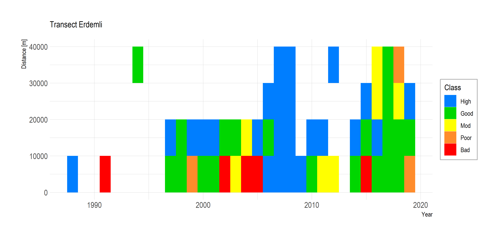

# ETC-ICM trends Mersin

### Contents

* [Preprocessing ](#preprocessing)
* [Import to R](#import-to-r)
* [Transects](#transects)
* [HEAT Method](#heat-method)
* [HEAT Results](#heat-results)

### Preprocessing
(Outside R)
The folder [data](/data/) contains the input data for the assessments.

The file received from METU was a text file `data_from_Mersin.txt`. This is data exported from an odv file. Before importing into R, I used a visual basic script `preprocess.wsf` to manipulate the data into a format more easily read by R. In theory this could all be done directly in R but it was quicker for me to add this extra step outside R.
The script file was run using the windows batch file `preprocess.bat`. The restructured data is saved as the file  `data_from_Mersin_for_R.txt`.

### Import to R
The file  `data_from_Mersin_for_R.txt` is read into an R data frame using [Mersin_read_data.R](/Mersin_read_data.R). The data frame is saved as an R data file `data_from_Mersin.Rda`

### Transects
Two transects are defined for making the HEAT calculations: *Mersin* and *Erdemli*. The code for plotting these transects is in the file [Mersin_plot_transects.R](/Mersin_plot_transects.R)

#### 1. Mersin Transect 
The first transect starts at Mersin (TM36 x=381962 y=4075951). The transect is divided into 5 km x 5 km grid squares and extends southwards from the coast at Mersin 50 km out into open waters, giving 10 assessment units within the transect.

#### 2. Erdemli Transect 
The second transect starts at Erdemli. In ArcGIS, the *buffer* function is used to divide the waters into bands of distance from the coast at 5 km intervals, up to 25 km, giving 5 bands in total, each 5 km wide. The lateral start and end boundaries of the bands perpendicular to the coastline were chosen arbitrarily, intending only to enclose the area with relatively high density of observations close to Erdemli.

### HEAT Method 

The HEAT calculations compare observed values with target values to calculate eutrophication ratio. The file [targets.R](/targets.R) generates a dataframe with target values.

###### **Table of target values** 

Parameter | Months | Value | Response
------------ | ------------ | ------------- | -------------
TP [µM] | Jan-Mar | 0.23 | +ve
NO3NO2 [µM] | Jan-Mar | 0.71 | +ve  
Chla [µM] | Apr-May | 1.00 | +ve
SD [m]  | Apr-Sep | 9.00 | -ve

[Tugrul et al. (2018)](https://link.springer.com/article/10.1007%2Fs11356-018-2529-6)

For each profile at a particular position on a particular date, we take the maximum value of chl or nutrient concentration at depths of 10 m or less. For example, if there was a Chl *a* measurement at 0 m and also one at 5 m, then we take the greatest of the two values. 

Now we have a single value of each parameter for each profile. We then collect all values of the parameter within the assessment unit from the relevant months (according to the table of target values) and calculate an average value for each combination of Year, Parameter and Assessment unit.

The HEAT assessment is made by comparing the mean parameter value with the target values. The calculations are done using  [Mersin_HEAT.R](/Mersin_HEAT.R) . First, data from the cruises is matched to assessment units shown in the introduction [README](/README.md) then the HEAT calculations are dones and plots of the results made.
 
### HEAT Results
The plots of HEAT classification by year in each assessment unit.

